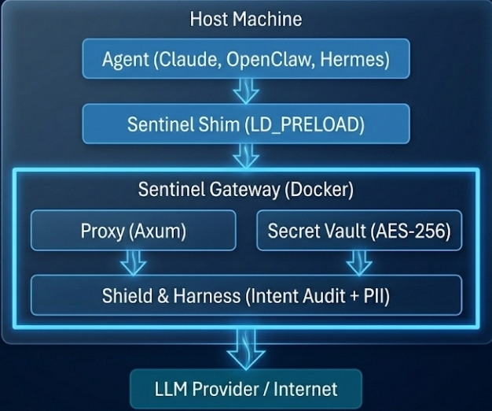

# SentinelClaw

**The security gateway for autonomous AI agents. Secrets they never see. Commands they can't bypass.**

[](LICENSE)
[](https://doc.rust-lang.org/book/)
[](https://www.docker.com/)
[](CHANGELOG.md)

---

## Overview

AI agents that can execute code, access APIs, and modify files are powerful — and dangerous. They hallucinate destructive commands, leak secrets in prompts, and bypass safety rails the moment they gain shell access.

**SentinelClaw** sits between your agents and the outside world. It intercepts every LLM request, tool call, and syscall, redacting secrets in real-time and blocking malicious intent before execution.

Agents never see your real API keys. Instead they operate on **Ghost IDs** — opaque, cryptographically secure tokens. Sentinel materializes the real value only at the final millisecond of execution, then scrubs it from memory.

### How it works

```
Agent reads .env → sees OPENAI_API_KEY=sentin_openai_1
Agent sends prompt → Sentinel audits + redacts PII
Agent executes command → Sentinel evaluates intent → approves/denies
Agent calls API → Sentinel materializes real key → request fires → key scrubbed
```

### Who it's for

- Anyone running autonomous agents (Claude, AutoGPT, custom bots) on a VPS or local machine
- Teams that need audit trails for agent actions
- Developers who want to give agents broad access without broad risk

---

## Features

- **Ghost ID Architecture** — AES-256-GCM encrypted secret vault. Agents never touch plaintext credentials.
- **Unified Sentinel Proxy** — All LLM traffic routes through Sentinel. Every prompt and tool call audited before leaving the machine.
- **Kernel-Level Hardening** — Seccomp-BPF syscall trapping, Landlock filesystem restrictions, ptrace process supervision.
- **Intent-Aware Governance** — Per-agent autonomy modes: `strict` (veto all), `balanced` (audit all), `autonomous` (log and permit).
- **PII Redaction** — Real-time pattern matching with 1600+ regex signatures covering emails, phones, SSNs, credit cards, and API keys.
- **SafeTry Rollbacks** — Automatic filesystem snapshotting before high-risk agent actions. One Telegram command to undo.
- **Telegram Governance** — Remote approve/deny agent commands, manage secrets, toggle PII mode, all from your phone.
- **Real-Time Dashboard** — Glassmorphic SSE telemetry stream on port 3333 showing every materialization, redaction, and veto.
- **LD_PRELOAD Shim** — Universal libc-level interception (`read`, `fgets`, `mmap`) that scrubs secrets from process memory.
- **Dynamic Identity Extraction** — Zero-config agent tracking by project structure and execution path.

---

## Architecture

SentinelClaw uses a **hybrid model** — the security engine (proxy, vault, shield) runs inside a Docker container for hardening, while agents run on the host and are intercepted by kernel-level shims and traps that transparently route all traffic through the gateway.



---

## Quick Start

### Prerequisites

| Requirement | Notes |
|---|---|
| Docker + Docker Compose | Required. Sentinel runs as a containerized appliance. |
| Linux (Ubuntu/Debian recommended) | Required for kernel-level features (Seccomp-BPF, Landlock). |
| x86_64 architecture | Required for `sentinel run` bare-metal mode only. Proxy/vault/dashboard are architecture-agnostic. |
| Telegram bot token | Optional. Enables remote governance. Create one via [@BotFather](https://t.me/BotFather). |

### Install

```bash
git clone https://github.com/Morravex/sentinel-claw.git
cd sentinel-claw
./setup.sh
```

`setup.sh` does everything:
1. Checks Docker is installed
2. Prompts for Telegram credentials (optional)
3. Creates `.env` with a generated pairing key
4. Creates `.env-<agent>` vaults for 10 agent slots (ports 8080–8089)
5. Builds and launches the Docker container
6. Generates 40+ runtime shims (`python`, `node`, `curl`, `git`, etc.)
7. Injects the shim path into your shell profile

After setup, verify Sentinel is running:

```bash
curl http://localhost:8080/health
# {"status": "sentinel", "version": "0.0.1"}
```

---

## Usage

### Proxy Mode (recommended)

Point any agent at Sentinel as its LLM proxy. Secrets are automatically intercepted.

```bash
# OpenAI-compatible agents set their base URL:
export OPENAI_BASE_URL=http://localhost:8080

# Sentinel intercepts the request, audits the prompt,
# materializes the real API key, forwards it, then scrubs.
```

### Bare-Metal Run

Execute any command with full kernel-level network isolation:

```bash
# All network calls are trapped and routed through Sentinel
sentinel run python3 agent.py

# With autonomy override
sentinel run --strict curl https://api.example.com
sentinel run --autonomous node bot.js
```

### Telegram Governance

After setup, message your bot to manage Sentinel remotely:

| Command | Description |
|---|---|
| `/status` | System health, active ports, connection status |
| `/add_key` | Vault a new API key into the encrypted mesh |
| `/add_pii` | Vault PII (name, SSN, address) as a Ghost ID |
| `/mode [pid] [mode]` | Set autonomy: `strict`, `balanced`, or `autonomous` |
| `/pii_on` / `/pii_off` | Toggle real-time PII redaction |
| `/history` | Last 10 security events (redactions, materializations) |
| `/snapshot_on` / `/snapshot_off` | Toggle filesystem checkpointing |
| `/rollback [pid]` | Restore workspace to pre-execution state |
| `/allowlist` | View trusted command patterns |
| `/clear_mesh` | Emergency: purge all Ghost ID mappings |
| `/stop` | Emergency shutdown |

### Dashboard

Open `http://localhost:3333` for a real-time glassmorphic dashboard showing every secret materialization, redaction, and command veto.

---

## Configuration

### Environment Variables

Copy `.env.example` to `.env` (or let `setup.sh` create it):

```bash
cp .env.example .env
```

| Variable | Required | Description |
|---|---|---|
| `TELEGRAM_BOT_TOKEN` | No | Bot token from @BotFather |
| `TELEGRAM_CHAT_ID` | No | Your Telegram chat ID (from @userinfobot) |
| `SENTINEL_PAIRING_KEY` | Yes | AES-256 master key. Auto-generated by `setup.sh`. |
| `SENTINEL_DB_PATH` | No | Path to SQLite database (default: `sentinel.db`) |

### Sentinel Config (`sentinel.toml`)

`setup.sh` copies `sentinel.toml.example` to `sentinel.toml` on first run. Key sections:

```toml
[general]
mode = "hybrid"           # "local_only", "hybrid", or "cloud_only"
socket_path = "/tmp/sentinel.sock"

[agents]
openclaw = 8080           # Per-agent port isolation (8080-8089)
hermes = 8081

[providers]
openai = "https://api.openai.com/v1"
openrouter = "https://openrouter.ai/api/v1"
groq = "https://api.groq.com/openai/v1"
anthropic = "https://api.anthropic.com/v1"

[policy]
pii_redaction = true
deny_list = ["rm -rf /", "sudo", "unlink", "truncate", "shred", "pkill -f sentinel"]
restricted_paths = [".env", "/etc/passwd", "/etc/shadow", ".git", "id_rsa"]
```

### Agent Isolation

Each agent gets its own vault file and port:

```bash
# Per-agent API keys (isolated from other agents)
cat .env-openclaw
# OPENAI_API_KEY=sk-...
# OPENROUTER_API_KEY=sk-or-v1-...

# Agent routes through its dedicated port
export OPENAI_BASE_URL=http://localhost:8080   # openclaw
export OPENAI_BASE_URL=http://localhost:8081   # hermes
```

---

## Testing

```bash
cargo test
```

The test suite covers:
- **Entropy analysis** — Shannon entropy calculation for secret detection
- **Pattern matching** — API key detection for OpenAI, OpenRouter, Groq, Anthropic, AWS, Stripe, and RSA private keys
- **Shell auditing** — Blocking destructive commands (`rm -rf /`, `sudo`, `nmap`, `base64` decode chains)

---

## Project Structure

```
sentinel-claw/
├── Cargo.toml                 # Rust binary crate (edition 2021)
├── Dockerfile                 # Multi-stage production build
├── docker-compose.yml         # Service orchestration (10 agent ports)
├── sentinel.toml.example      # Configuration template
├── setup.sh                   # One-command bootstrap
├── .env.example               # Environment variable template
├── LICENSE                    # Apache 2.0
├── shim/
│   └── sentinel_scrub.c       # LD_PRELOAD libc interceptor (C)
├── src/
│   ├── main.rs                # Entry point, CLI, single-instance lock
│   ├── lib.rs                 # Public module exports
│   ├── config.rs              # TOML + env config loading
│   ├── vault.rs               # Agent key vault (per-agent env isolation)
│   ├── shield.rs              # Secret detection, AES-256-GCM, PII regex
│   ├── proxy.rs               # Axum HTTP/Unix proxy (LLM traffic)
│   ├── harness.rs             # Intent audit, cache layer
│   ├── bridge.rs              # Telegram bot (approve/deny, governance)
│   ├── launcher.rs            # Seccomp-BPF, ptrace, Landlock, TLS MITM
│   ├── dashboard.rs           # Real-time SSE web dashboard
│   └── logger.rs              # Structured audit log broadcaster
└── tests/
    └── shield_tests.rs        # Unit tests (entropy, patterns, shell audit)
```

---

## Contributing

Contributions are welcome. Here's how to get started:

1. Fork the repository
2. Create a feature branch (`git checkout -b feature/your-feature`)
3. Make your changes
4. Run `cargo test` to verify
5. Run `cargo clippy` and fix any warnings
6. Submit a pull request

Please ensure all code includes the Apache 2.0 license header:

```rust
// Copyright 2026 Morravex
//
// Licensed under the Apache License, Version 2.0 (the "License");
// you may not use this file except in compliance with the License.
// You may obtain a copy of the License at
//
//     http://www.apache.org/licenses/LICENSE-2.0
```

---

## Security

If you discover a security vulnerability, please **do not** open a public issue. Instead, report it privately to the maintainers.

SentinelClaw's own security posture:
- All secrets are encrypted at rest with AES-256-GCM
- Master key is derived from `SENTINEL_PAIRING_KEY` via PBKDF2
- The proxy uses TLS interception with a local-only CA
- Seccomp-BPF filters prevent agents from killing the Sentinel process
- Landlock restricts filesystem access to approved paths only

---

## License

This project is licensed under the **Apache License, Version 2.0**.

See [LICENSE](LICENSE) for the full text.

```
Copyright 2026 Morravex

Licensed under the Apache License, Version 2.0 (the "License");
you may not use this file except in compliance with the License.
You may obtain a copy of the License at

    http://www.apache.org/licenses/LICENSE-2.0

Unless required by applicable law or agreed to in writing, software
distributed under the License is distributed on an "AS IS" BASIS,
WITHOUT WARRANTIES OR CONDITIONS OF ANY KIND, either express or implied.
See the License for the specific language governing permissions and
limitations under the License.
```
